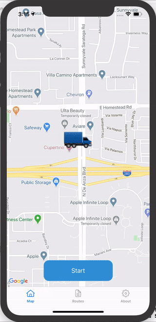

# RecordingRoutes

## App that tracks user location and save it locally.

The app has the following features:

- Google Maps
- MVVM pattern
- Core Location
- Core Data
- Responsive
- CocoaPods
- SQLite

